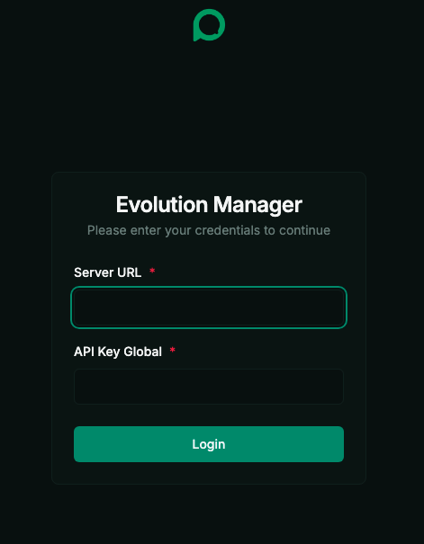

# Evolution API con Docker Compose

Este repositorio proporciona una configuración de Docker Compose para ejecutar Evolution API junto con sus servicios requeridos (PostgreSQL y Redis). Esta configuración está diseñada para ser multiplataforma y se puede ejecutar en cualquier máquina con Docker y Docker Compose instalados.

## Requisitos previos

- [Docker](https://docs.docker.com/get-docker/)
- [Docker Compose](https://docs.docker.com/compose/install/) (generalmente incluido con Docker Desktop)

## Cómo empezar

Sigue estos pasos para poner en marcha tu instancia de Evolution API.

### 1. Clonar el repositorio

```bash
git clone https://github.com/devalexcode/shell-evolution-api.git
```

### 2. Ingresa a la carpeta del proyecto

```bash
cd shell-evolution-api
```

### 3. Crea y configura el archivo de entorno

Crea un archivo `.env` copiando el archivo de ejemplo:

```bash
cp .env.example .env
```

Ahora, abre `.env` con un editor de texto y personaliza las variables según sea necesario. Como mínimo, debes establecer una contraseña segura para PostgreSQL y una clave de API única.

```bash
nano .env
```

Estas son las variables clave a configurar:

```dotenv
############################################
# Evolution API
############################################

# ------------------------------------------
AUTHENTICATION_API_KEY=api_key # CREAR - SE RECOMIENDA UUID
# ------------------------------------------
EVOLUTION_API_PORT=8080 # 
# ------------------------------------------
CONFIG_SESSION_PHONE_VERSION=2.3000.1023204200
# ------------------------------------------

############################################
# PostgreSQL
############################################

# ------------------------------------------
POSTGRESS_USER=user # CAMBIAR POR UNO SEGURO
# ------------------------------------------
POSTGRESS_PASS=123456 # CAMBIAR POR UNO SEGURO
# ------------------------------------------
POSTGRESS_PORT=5432
# ------------------------------------------

############################################
# Redis
############################################

REDIS_PORT=6379 
```

### 4. Iniciar los servicios

Una vez que tu archivo `.env` esté configurado, puedes iniciar todos los servicios usando Docker Compose:

```bash
docker compose up -d
```

Este comando descargará las imágenes de Docker necesarias e iniciará los contenedores de Evolution API, PostgreSQL y Redis en segundo plano.

## Ingresar a Evolution API

Una vez que los contenedores estén en funcionamiento, puedes acceder a la interfaz de administrador de Evolution API en tu navegador.

-   **URL**: `http://localhost:<EVOLUTION_API_PORT>/manager`
-   Reemplaza `<EVOLUTION_API_PORT>` con el puerto que configuraste en tu archivo `.env` (el predeterminado es `8080`).





## Administrar los servicios

-   Para ver los logs de los servicios:
    ```bash
    docker compose logs -f
    ```
-   Para detener los servicios:
    ```bash
    docker compose down
    ```

¡Listo! Con estos pasos tendrás Evolution API funcionando en tu máquina.

## 👨‍💻 Autor

Desarrollado por [Alejandro Robles | Devalex ](http://devalexcode.com)  
¿Necesitas que lo haga por ti? ¡Estoy para apoyarte! 🤝 https://devalexcode.com/soluciones/evolution-api-whatsapp-en-servidor-vps

¿Dudas o sugerencias? ¡Contribuciones bienvenidas!
